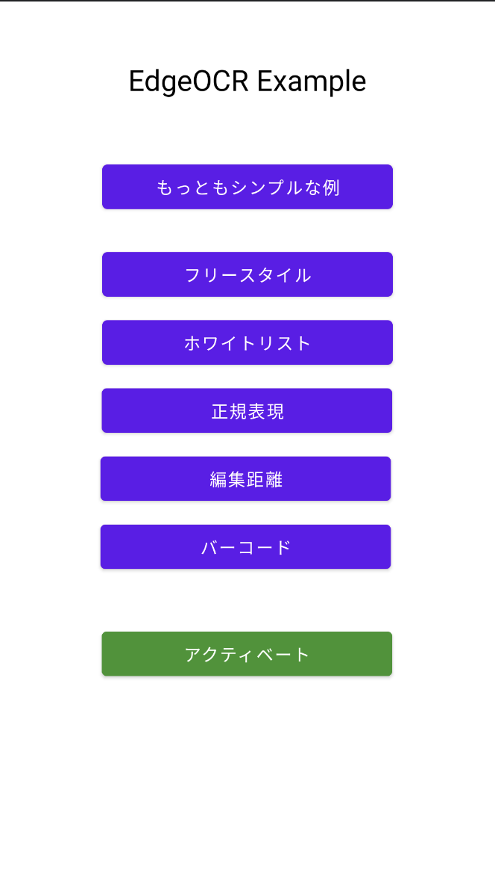
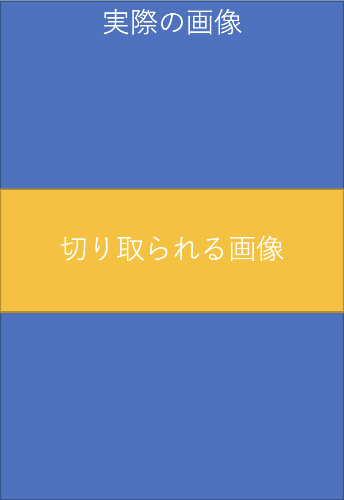
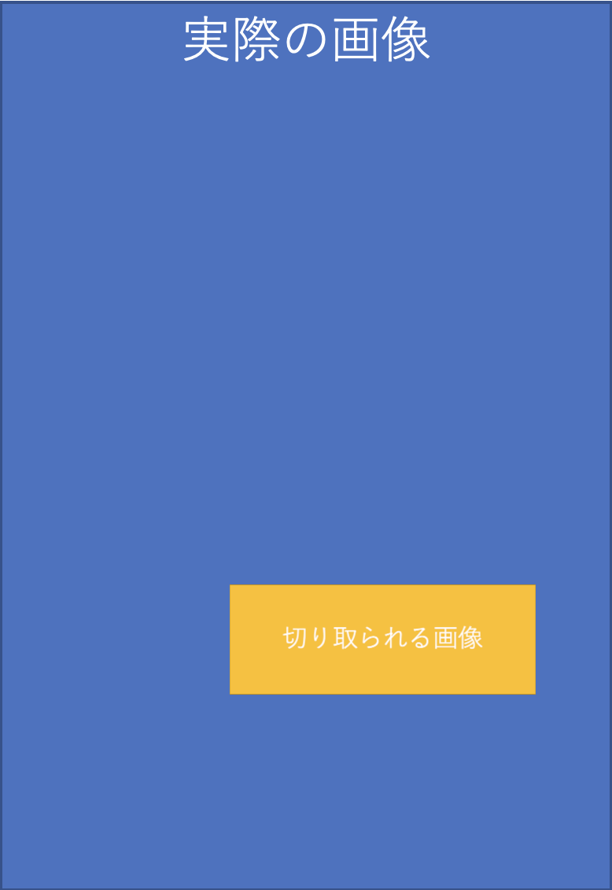
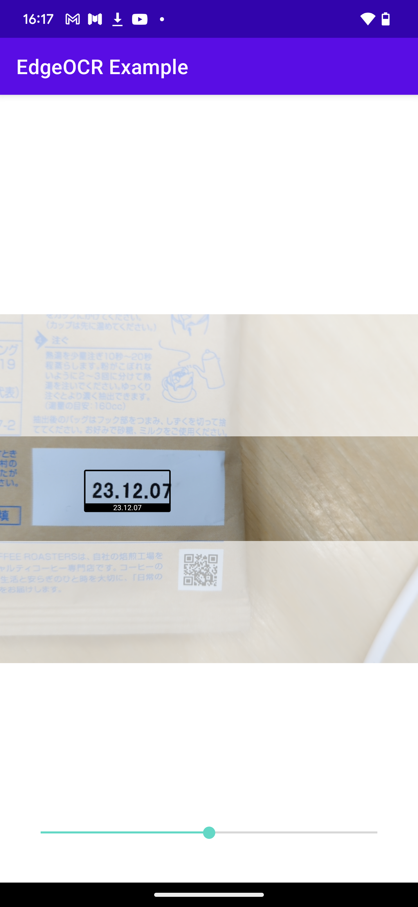
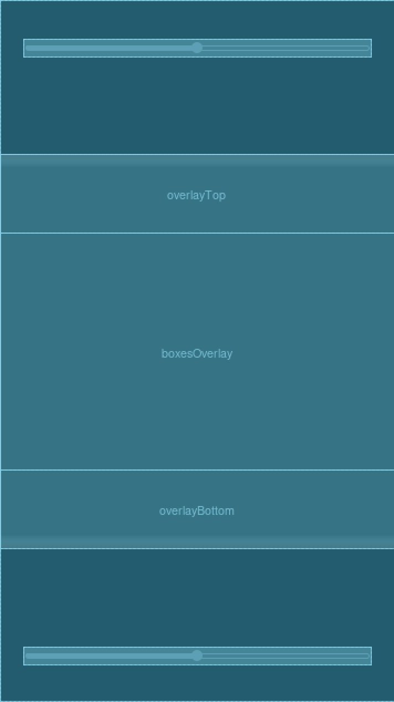
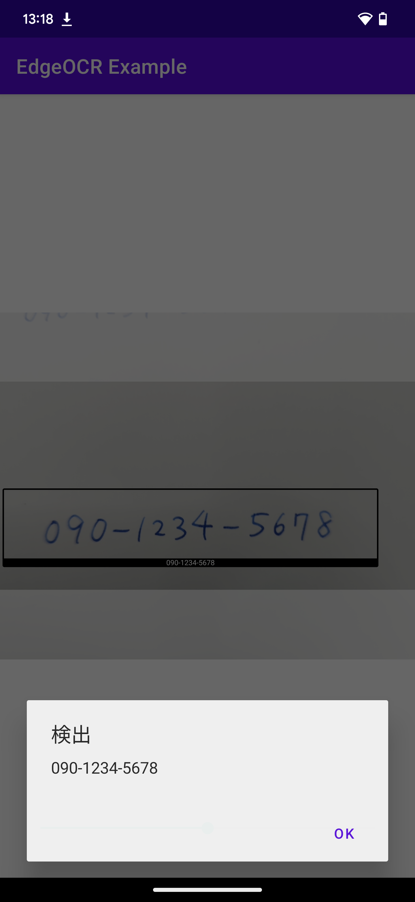

# EdgeOCR SDK チュートリアル

EdgeOCR SDK（以下 SDK）の使い方をサンプルコードを交えて説明します。
サンプルコードは、app ディレクトリに含まれています。

チュートリアルでは Android Studio を用いての開発を想定していますが、gradle ベースのプロジェクトを扱える他の環境（VS Code など）でも使用可能です。

まず環境の構築方法・デバイスのアクティベーション方法を説明し、そのあとに簡単な例から順を追って説明します。

## 環境構築

本レポジトリーのサンプルアプリをビルドするには、SDK とモデルファイルをダウンロードする必要があります。
なお、SDK のバージョンと本サンプルアプリが想定する SDK のバージョンが一致している必要があります。
本レポジトリーの git tag と SDK のバージョンは一致していますので、git tag を確認してください。

SDK の zip を本レポジトリーのルートディレクトリーに配置し、解凍してください。`edge_ocr_sdk_maven` ディレクトリーが作成されます。
`settings.gradle` で以下のように参照されますので、もしパスが変わっている場合は変更してください。
```gradle
dependencyResolutionManagement {
    repositories {
        // ...
        maven {
            url "$rootDir/edge_ocr_sdk_maven"
        }
    }
}
```
本サンプルアプリが想定する SDK のバージョンは、`app/build.gradle` で指定されています。
```gradle
dependencies {
    // ...
    implementation "com.nefrock.edgeocr:edgeocr:1.0.0"
}
```
ダウンロードした SDK のバージョンと一致しない場合は、ビルドエラーが発生します。

モデルファイルは、`app/src/main/assets` ディレクトリーに配置し、解凍してください。`app/src/main/assets/models` ディレクトリーが作成されます。

ここまで完了したら Android Studio で example ディレクトリを開いて、ビルドをしてみてください。

## アクティベーション

SDK のスキャン機能を使う前に、SDK を使用するデバイスでライセンスのアクティベーションをする必要があります。アクティベーションは、そのデバイスではじめて SDK を使うときのみ必要で、1 回行ってしまえば次回以降は必要ありません。アクティベーションはオンライン環境で行う必要があります。

> デバイスのファクトリーリセットを行うと、再度のアクティベーションが必要になり、別デバイスとして登録されますのでご注意ください。

アクティベーション、またはアクティベーション状態の確認を行うには、まず `NefrockLicenseAPI` を初期化します。
```Java
NefrockLicenseAPI licenseAPI = new NefrockLicenseAPI.Builder(<Context>)
    .withLicenseKey(<your key>)
    .build();
```
`Context` には、アプリの `Context` を渡します。`<your key>` の部分には、ライセンスキーを入れてください。

アクティベーションを行うには、`activate` を呼び出します。
```Java
ListenableFuture<License> activate(
            @Nullable ActivationCallback callback,
            @Nullable ActivationErrorCallback errorCallback);
```
- `callback` には、アクティベーションが成功したときに呼び出されるコールバックを渡します。
- `errorCallback` には、アクティベーションが失敗したときに呼び出されるコールバックを渡します。

一度アクティベーションを行うと、次回以降はアクティベーションを行う必要はありません。ライセンス情報
はファイルに保存されますので、アプリを再起動してもアクティベーションを行う必要はありません。

アクティベーション状態の確認は、`isActivated` で行います。
```Java
ListenableFuture<License> isActivated(
            @Nullable ActivationCallback callback,
            @Nullable ActivationErrorCallback errorCallback);
```
ライセンスファイルからライセンス情報を読み込みます。そのファイルが見つからない場合、
サーバーに問い合わせする可能性があるため、非同期で行われます。この関数を呼ぶことにより、
新しいデバイスとして登録されることはありません。
- `callback` には、アクティベーションが確認できたときに呼び出されるコールバックを渡します。
- `errorCallback` には、アクティベーションが確認できなかったときに呼び出されるコールバックを渡します。

このアクティベーションフローの例は`app/src/main/java/com/nefrock/edgeocr_example/ui/MainActivity.java`に定義されていますので、ご参考にしてください。

実際で試したい場合は、サンプルアプリを実機にインストールし、起動する最初の画面（メイン画面）でアクティベーションボタンを押してみてください。一番下の緑色のボタンです。

「メイン画面」
<br/>

<br/>
<br/>

アクティベーション済みの場合、アクティベーションボタンは「アクティベーション済み」と表示されます。

## もっともシンプルな例

「もっともシンプルな例」は、カメラを起動して画面に映った文字をログに出力するサンプルです。

ログはスマホの画面には表示されません。Android Studio での Logcat などに表示されます。

この例はメイン画面の一番上のボタンを押すと起動される画面で、
`app/src/main/java/com/nefrock/edgeocr_example/ui/SimpleTextScannerActivity.java`に定義されています。

カメラ周りの実装はアンドロイドの[CameraX](https://developer.android.com/training/camerax?hl=ja)を使用しています。

このクラスでは`OnCreate`でアクティビティが作成さ時に、API を初期化し、使用するモデルを選択しています。

```Java
@Override
protected void onCreate(Bundle savedInstanceState) {
    super.onCreate(savedInstanceState);
    setContentView(R.layout.activity_simple_text_scanner);
    // Initialize EdgeOCR
    Model model = null;
    try {
        api = new EdgeVisionAPI.Builder().fromAssets(getApplicationContext(), "models").build();
        for (Model candidate : api.availableModels()) {
            if (candidate.getUID().equals("model-small")) {
                model = candidate;
            }
        }
    } catch (Exception e) {
        Log.e("EdgeOCRExample", "[onCreate] Failed to initialize EdgeOCR", e);
        return;
    }

    if (model == null || api == null) {
        Log.e("EdgeOCRExample", "[onCreate] Failed to initialize EdgeOCR");
        return;
    }

    api.useModel(model, (ModelInformation modelInformation) -> {
        //モデルがロードされた時の処理をかく
    }, (EdgeError e) -> Log.e("EdgeOCRExample", "[onCreate] Failed to load model", e));
    if (cameraPermissionGranted()) {
        startCamera();
    } else {
        ActivityCompat.requestPermissions(
                this, new String[]{"android.permission.CAMERA"}, 10);
    }
}
```

まずはじめに api を `assets/models` ディレクトリの内容で初期化し、その後、`api.useModel`で api に `model-large` を使うように指定しています。

SDK のデフォルトでは `model-small`、 `model-large` が指定できます。`model-large` の方がより高精度のモデルですが、そのぶん実行時間がかかります。ユースケースやデバイスのスペックに合わせてどのモデルを使うかを選択してください。また、モデルをカスタマイズした場合には違うモデルが選択できるようになります。

次に、カメラから送られてくる各フレームごと画像に対して実際に OCR する部分を説明します。この処理は同クラスの `startCamera` メソッドに書かれていています。

まず、[CameraX の ImageAnalysis](https://developer.android.com/training/camerax/analyze?hl=ja) オブジェクトを作成します。

```Java
// Set up image analysis using EdgeOCR
imageAnalysis = new ImageAnalysis.Builder()
        .setOutputImageFormat(ImageAnalysis.OUTPUT_IMAGE_FORMAT_YUV_420_888)
        .setBackpressureStrategy(ImageAnalysis.STRATEGY_KEEP_ONLY_LATEST)
        .build();
```

YUV_420_888 形式で、画像を取得するようにしている点と、`STRATEGY_KEEP_ONLY_LATEST` を使って[ノンブロッキング](https://developer.android.com/reference/androidx/camera/core/ImageAnalysis?hl=ja#STRATEGY_KEEP_ONLY_LATEST)で解析を回すようにしている点に注意してください。

次に ImageAnalysis に OCR するアナライザーを設定します。

```Java
imageAnalysis.setAnalyzer(analysisExecutor, new ImageAnalysis.Analyzer() {
    @Override
    public void analyze(@NonNull ImageProxy image) {
        if (!api.isReady()) {
            image.close();
            return;
        }
        ScanResult analysisResult = api.scanTexts(image);
        List<Detection> detections = analysisResult.getDetections();
        for(Detection detection: detections) {
            String text = detection.getText();
            if(!text.isEmpty()) {
                Log.d("EDGE_OCR_FIRST_EXAMPLE", "detected: " + detection.getText());
            }
        }
        image.close();
    }
});
```

`ImageAnalysis.setAnalyzer` の第二引数にアナライザーを渡していて、アナライザーの `analyze` メソッドに処理を記述しています。このサンプルでは簡単のためアナライザーは無名クラスで定義しています。

`api.scanTexts` の戻り値は `ScanResult` オブジェクトで、このオブジェクトから `getDetections` で OCR 結果が取得できます。scanTexts は画面に映っているテキストのすべてをスキャンするので、複数の `Detection` オブジェクトが返ってきます。

（実際には、SDK は画像に写っているすべてのテキストを読み取っているわけではなく、`真ん中あたりのテキスト`を OCR しています。詳細は次節の「SDK が解析する画像の範囲について」で説明します。）

Detection オブジェクトのクラス定義は次です。

```Java
public class Detection {

    //省略...

    public RectF getBoundingBox() {
        return boundingBox;
    }

    public float getConfidence() {
        return confidence;
    }

    public Category getCategory() {
        return category;
    }

    public String getText() {
        return text;
    }
}
```

上から、検出されたテキストの画像内の矩形（バウンディングボックス）、スキャン結果の信頼度、カテゴリ、読み取られたテキストの中身を取得できます。

このサンプルではログに出力するだけなので、`getText()` を読んでテキストを取得しています。

以上がシンプルな例のコードの説明です。コード量はそれなりにありますが、カメラ周りのお約束コードが多く、OCR まわりのコードは少なくてすむことを理解いただけたら幸いです。

### `AndroidManifest.xml`

カメラ周りの機能を使うため次の 3 行を追加してあります。SDK を組み込むアプリの xml にも同様に追加してください。

```xml
<uses-permission android:name="android.permission.CAMERA" />
<uses-feature android:name="android.hardware.camera" />
<uses-feature android:name="android.hardware.camera.autofocus" />
```

### SDK が解析する画像の範囲について

`api.scanTexts` が解析する範囲は、指定したモデルに依存します。ここではデフォルトで提供されている `model-small` と `model-large` について説明します。

モデルはインプットとして取れる画像のアスペクト比を持っており、
`model-small`、`model-large` は、それぞれ `256x64（width x height）`、`256x128` のアスペクト比の画像をインプットの画像として受け取ることを想定しています。

インプットの画像として、モデルが想定しているアスペクト比とは異なる画像が渡された場合は、SDK は画像をそのアスペクト比になるように、画像の一部（規定の場合中心部分）を切り取りモデルに渡します。

下記の画像のように、切り取りる範囲は、横幅はインプット画像の幅と同じ、縦幅はモデルの想定しているアスペクト比を保つように計算します。そうして計算された画面中心の矩形範囲をモデルに渡します。たとえば画像のサイズを 360x720 とすると、`model-small` を使用した場合に、切り取られる画像の大きさは 360x90 です。高さはの算出方法は 360x64/256=90 です。

中心部分ではなく、画像の他の部分を自由に切取り、スキャンすることも可能です。その場合は、`api.scanText`に
`cropLeft`、`cropTop`、`cropSize`を渡してください。規定では、`cropLeft = 0.0` , `cropTop = 0.5` ,
 `cropSize = 1.0` となっています（以下の左の画像）。つまり、切り取られる画像のサイズはアスペクト比が許す
限り大きくなり、実際の画像の縦方向の中心部となります。この場合は、画像の横方向の全部を切り取られますので、
`cropLeft`は位置に影響しません。

以下の右の画像では、`cropLeft = 0.75` , `cropTop = 0.75` , `cropSize = 0.5` としています。
実際の画像の右下の方に位置する、アスペクト比が許す最大サイズの半分の大きさの画像が切り取られます。
このように、`cropLeft`、`cropTop`、`cropSize`を指定することで、画像の任意の部分を切り取って
スキャンすることができます。

<br/>
<figure style="display:inline-block">
  
  <figcaption>api.scanText(image)</figcaption>
</figure>
<figure style="display:inline-block">
  
  <figcaption>api.scanText(image, 0.75, 0.75, 0.5)</figcaption>
</figure>
<br/>
<br/>

アスペクト比はモデルを指定した時の`ModelInformation`オブジェクトのから、次のように取得できます。

```Java
//TextScannerActivity.java
api.useModel(model, (ModelInformation modelInformation) -> {
          float aspectRatio = modelInformation.getAspectRatio();
          ...
```

`TextScannerActivity` では、アスペクト比を取得して、モデルが読み込まない部分をホワイトアウトしています。

別のアスペクト比を持つモデルが必要な場合は、弊社カスタマーサポートにご連絡ください。また Bitmap を入力とするような高レベル API も開発中ですので、必要であればそちらも提供いたします。

### GPU を使用するモデルのロードにかかる時間について

GPU を使用するモデルは、初回のロード時のみロード時間が数秒かかります。この時間はローエンドのデバイスほど時間がかかる傾向にあります。ただし 2 回目以降のロードは高速に処理され、アプリを削除しない限りはロードに数秒かかることはありません。

## 実用的な例

「もっともシンプルな例」では、OCR 機能のみに焦点を当てて説明しました。この節では OCR 以外の機能も作り込み、ユーザーが実際に業務で使用するアプリケーションを作成するヒントとなるようなサンプルを説明します。

この節で説明するすべての例は、`app/src/main/java/com/nefrock/edgeocr_example/ui/TextScannerActivity.java` で定義されている `TextScannerActivity` クラスを使用してます。

### フリースタイル

このサンプルでは OCR 結果を画面に表示する方法を説明いたします。
でき上がりの画面イメージはこんな感じです。

<br/>

<br/>
<br/>

こんサンプルは「もっともシンプルな例」に加えて次の 2 つのことをしています。

- OCR 対象以外の画面領域をホワイトアウトする
- OCR 結果を画面上に表示する

OCR 結果の表示や、画面のホワイトアウトは、プレビューの上に新たなビューをオーバーレイすることにより実現しています。

レイアウトの定義は`app/src/main/res/activity_text_scanner.xml`にあります。


<br/>

<br/>
<br/>

上の図の `overlayTop`、`overlayBottom` の背景を白（透過）にすることによりホワイトアウトを実現し、`boxesOverlay` には OCR 結果を表示します。レイアウトは機種依存であるカメラの画角や、使用するモデルのアスペクト比によって決まりますので、動的に決定する必要があります。

ではここからは、「もっともシンプルな例」からの変更点を実際に見ていきます。

まず、`TextScannerActivity` クラスの `api.useModel` に渡しているコールバックの中でレイアウトの計算をしています。モデルのアスペクト比を `ModelInformation` オブジェクトから取得し、「SDK が解析する画像の範囲について」で説明した通りに SDK の解析範囲を計算し、レイアウトを決定しています。

レイアウトは下記のように UI スレッドでレイアウトを設定します。

```Java
runOnUiThread(() -> {
    overlayTop.setLayoutParams(overlayTopLayoutParams);
    overlayBottom.setLayoutParams(overlayBottomLayoutParams);
    boxesOverlay.setLayoutParams(boxesOverlayLayoutParams);
});
```

また見通しを良くするために、スキャンする処理を別クラスとして切り出しています。

```Java
imageAnalysis.setAnalyzer(analysisExecutor, imageAnalyser);
```

そして処理をするクラスは `app/src/main/java/com/nefrock/edgeocr_example/analysers/FreeStyleTextAnalyser.java` で定義してます。

またそのアナライザーのコールバックに結果を表示するように記述しています。ここでも UI スレッドを使用します。

```Java
public void call(List<Detection> filteredDetections, List<Detection> allDetections) {
  runOnUiThread(() -> {
      boxesOverlay.setBoxes(allDetections);
  });
  //以下略...
}
```

上記の `boxesOverlay.setBoxes` で、OCR の結果（`List<Detection>`）を `boxesOverlay`渡して画面に表示させています。実際の処理は `app/src/main/java/com/nefrock/edgeocr_example/ui/BoxesOverlay.java` に書かれています。コールバックには、`Detection` クラスのリストが 2 つ渡されてきていますが、今回はスキャンされたテキストすべてを表示するので後者を使用します。

このサンプルではスキャンされたテキストをすべて表示する例を説明しました。ただ実際のアプリケーションではスキャンされたテキストの中から、決まったパターンのテキストのみ使用するといったことが多いのではないでしょうか？次節からはそういったサンプルを扱います。

#### 誤読を減らすためには？

スキャン結果が不安定であれば、何回か同じものを読んだら、アプリに通知するなどの処理を `FreeStyleTextAnalyser` クラスに実装するなどしてもいいかもしれません。
また次節以降のように、決まったパターン以外に反応させなければ、実質的には誤読は減りますので、そちらも検討してみてください。

それでも誤読が多い場合は弊社のカスタマーサポートにご連絡ください。弊社では OCR モデルを自社開発しており、特定の文字が読みづらい場合は、モデルを改良・カスタマイズすることで問題を本質的に解決することが可能です。

### ホワイトリスト

「フリースタイルの例」では表示するだけですが、実際にはスキャン結果を既存のマスターデータと突合することが多いのではないでしょうか。この例では、Java の `Set` にマスターデータを保存して、OCR 結果と突合しています。このコードは `WhitelistTextAnalyser` クラスに書かれています。ホワイトリストはここでは特定の電話番号としています。

```Java
public class WhitelistTextAnalyser extends AnalyserWithCallback {

    private final EdgeVisionAPI api;
    private volatile boolean isActive;
    private final Set<String> whiteList;

    public WhitelistTextAnalyser(EdgeVisionAPI api) {
        this.api = api;
        this.isActive = true;
        this.whiteList = new HashSet<String>(){
            {
                add("090-1234-5678");
                add("090-0000-1234");
                add("090-2222-3456");
                add("090-4444-5555");
                add("090-6666-7777");
                add("090-8888-9999");
            }
        };
    }

    @Override @androidx.camera.core.ExperimentalGetImage
    public void analyze(@NonNull ImageProxy image) {
        try {
            if (!isActive) return;
            if (callback == null) return;
            if (!api.isReady()) throw new RuntimeException("Model not loaded!");
            List<Detection> detections = api.scanTexts(image, cropLeft, cropTop, cropSize, cropStart).getDetections();
            ArrayList<Detection> filteredDetections = new ArrayList<>();
            for (Detection detection : detections) {
                if(whiteList.contains(detection.getText())) {
                    filteredDetections.add(detection);
                    break;
                }
            }
            callback.call(filteredDetections, detections);
        } catch (RuntimeException e) {
            Log.e("EdgeOCRExample", Log.getStackTraceString(e));
        } finally {
            image.close();
        }
    }
    //以下略
}
```

`analyze` メソッドの中で、`whitelist` フィールドに含まれるテキストがあったら、それを `callback` の第 1 引数で返しています。第 2 引数はすべての検出オブジェクトを返しています。

また、この例では `whitelist` に含まれる文字列が発見されたら、OCR を中断してダイアログを表示します。

<br/>

<br/>
<br/>


この機能を実装しているのは `TextScannerActivity` クラスの次のコードです。

```Java
imageAnalyser.setCallback(new AnalysisCallback() {
              @Override
              public void call(List<Detection> filteredDetections, List<Detection> allDetections) {
                  runOnUiThread(() -> {
                      boxesOverlay.setBoxes(allDetections);
                  });
                  if(!showDialog) {
                      return;
                  }
                  if (filteredDetections.size() == 0) {
                      return;
                  }
                  runOnUiThread(() -> {
                      showDialog(filteredDetections);
                  });

              }
          });
```

`filteredDetections` のサイズが 0 でない場合は、`showDialog` メソッドでダイアログを表示しています。またダイアログを表示し、OCR を中断するかは `showDialog` フィールドで管理しており、これは `MainActivity` から `Intent.putExtra` で渡されています。

```Java
findViewById(R.id.whitelist_ocr_button).setOnClickListener(new View.OnClickListener() {
          @Override
          public void onClick(View view) {
              Intent intent = new Intent(getApplication(), TextScannerActivity.class);
              intent.putExtra("analyser_type", "whitelist");
              intent.putExtra("show_dialog", true);
              startActivity(intent);
          }
      });
```

マスターデータに存在する特定の商品コードをスキャンしたいなどのユースケースの場合は、こちらの例を参考にしてみてください。

### 正規表現

「ホワイトリスト」方式は完全に一致するものをスキャンしますが、今回は制約をもう少し緩めて `正規表現` に一致するフォーマットをスキャンする例を挙げます。たとえばある特定のフォーマットの日付のみを読みたい場合です。これは`EditDistanceTextAnalyser` クラスで実装されていています。

```Java
public class RegexTextAnalyser extends AnalyserWithCallback {

    private final EdgeVisionAPI api;
    private volatile boolean isActive;
    private final Pattern regexPattern;

    public RegexTextAnalyser(EdgeVisionAPI api) {
        this.api = api;
        //2023.9.30、のような日付のみスキャンする(2020年代のみ)
        this.regexPattern = Pattern.compile(".*(202\\d\\.\\d{1,2}\\.\\d{1,2}).*");
        this.isActive = true;
    }

    @Override @androidx.camera.core.ExperimentalGetImage
    public void analyze(@NonNull ImageProxy image) {
        try {
            if (!isActive) return;
            if (callback == null) return;
            if (!api.isReady()) throw new RuntimeException("Model not loaded!");

            ScanResult analysisResult = api.scanTexts(image, cropLeft, cropTop, cropSize);
            List<Detection> rawDetections = analysisResult.getDetections();
            List<Detection> filteredDetection = new ArrayList<>();
            for (Detection rawDetection : rawDetections ) {
                String text = rawDetection.getText();
                Matcher matcher = regexPattern.matcher(text);
                if(matcher.find()) {
                    String newText = matcher.group(1);
                    Detection newDetection = new Detection(newText, rawDetection.getCategory(), rawDetection.getBoundingBox(), rawDetection.getConfidence());
                    filteredDetection.add(newDetection);
                }
            }
            callback.call(filteredDetection, rawDetections);
        } catch (RuntimeException e) {
            Log.e("EdgeOCRExample", Log.getStackTraceString(e));
        } finally {
            image.close();
        }
    }
    //以下略
}
```

このサンプルでは簡単のためドット区切りのみスキャンする正規表現ですが、正規表現を修正すれば「年月日」や「ハイフン区切り」などにも簡単に対応できます。

### 編集距離

OCR する環境が暗い、特殊なフォントや手書き漢字をスキャンしたいなどの理由で、OCR の精度がでない時は、基本的にはモデルをカスタマイズすることをご検討ください。

ただし特定のユースケースでは[編集距離](https://ja.wikipedia.org/wiki/レーベンシュタイン距離)に基づくマッチングを検討してみてもいいかもしれません。この方式は whitelist 方式に似ていますが、完全一致ではなく、ある程度の誤りを許すマッチングです。どれくらいの誤りを許すかはユースケース次第です。

この機能は、`EditDistanceTextAnalyser` に実装されていて、この例では関東地方の県名にマッチングさせています。

```Java
public class EditDistanceTextAnalyser extends AnalyserWithCallback {

    private final EdgeVisionAPI api;
    private volatile boolean isScanning;
    private final Levenshtein metrics;
    private final List<String> candidates;

    public EditDistanceTextAnalyser(EdgeVisionAPI api) {
        this.api = api;
        this.isScanning = true;
        this.metrics = new Levenshtein();
        this.candidates = new ArrayList<String>() {
            {
                add("東京都");
                add("神奈川県");
                add("群馬県");
                add("埼玉県");
                add("茨城県");
                add("栃木県");
                add("千葉県");
            }
        };
    }

    @Override
    @androidx.camera.core.ExperimentalGetImage
    public void analyze(@NonNull ImageProxy image) {
        try {
            if (!isScanning)
                return;
            if (callback == null)
                return;
            if (!api.isReady())
                throw new RuntimeException("Model not loaded!");

            ScanResult analysisResult = api.scanTexts(image, cropLeft, cropTop, cropSize);
            List<Detection> rawDetections = analysisResult.getDetections();
            List<Detection> filteredDetections = new ArrayList<>();
            for (Detection detection : rawDetections) {
                // N文字の間違いを許容する
                double minDist = 2;
                String text = detection.getText();
                Detection d = null;
                String minText = "";
                for (String candidate : candidates) {
                    double currentDist = metrics.distance(candidate, text);
                    if (currentDist < minDist) {
                        d = detection;
                        minDist = currentDist;
                        minText = candidate;
                    }
                }
                if (d != null) {
                    Detection newDetection = new Detection(minText, d.getCategory(), d.getBoundingBox(),
                            d.getConfidence());
                    filteredDetections.add(newDetection);
                }
            }
            callback.call(filteredDetections, analysisResult.getDetections());
        } catch (RuntimeException e) {
            Log.e("EdgeOCRExample", Log.getStackTraceString(e));
        } finally {
            image.close();
        }
    }
    //以下略
}

```

検出されたテキストにもっとも近い都道府県を検出結果として `filteredDetections` に追加しています。ここでは編集距離が 2 までを許容範囲としています。

ここまでで OCR のサンプルの説明は終了です。今回は触れませんでしたが、検出オブジェクトはバウンディングボックス（位置・大きさ情報）も持っているので、検出位置に応じた処理も書くことができます。たとえば次のようなことも可能です。

- 画面の中心にあるものを読む
- 1 番大きい文字を読む
- 「賞味期限」書いてある横の文字を読む
- などなど

現在に取り組んでいる問題の実装方法でご不明点がございましたら、弊社のカスタマーサポートにご連絡ください。弊社ではアプリへの組み込みのサポートも行っております。

## バーコード

バーコードを読み込むアナライザは `BarcodeAnalyser` です。

```Java
public class BarcodeAnalyser extends AnalyserWithCallback {

    private final EdgeVisionAPI api;
    private final BarcodeScanOption scanOption;
    private volatile boolean isScanning;

    public BarcodeAnalyser(EdgeVisionAPI api) {
        this.api = api;
        this.scanOption = new BarcodeScanOption(Arrays.asList(BarcodeFormat.FORMAT_CODE_128, BarcodeFormat.FORMAT_EAN_13));
        this.isScanning = true;
    }

    @Override @androidx.camera.core.ExperimentalGetImage
    public void analyze(@NonNull ImageProxy image) {
        try {
            if (!isScanning) return;
            if (callback == null) return;
            if (!api.isReady()) throw new RuntimeException("Model not loaded!");
            ScanResult analysisResult = api.scanBarcodes(image, scanOption);
            callback.call(analysisResult.getDetections(), analysisResult.getDetections());
        } catch (RuntimeException e) {
            Log.e("EdgeOCRExample", Log.getStackTraceString(e));
        } finally {
            image.close();
        }
    }
    //以下略
}
```

OCR の場合と基本的には同じですが、バーコードを読む場合は `api.scanTexts` の代わりに `api.scanBarcodes` を呼び出してください。`api.scanBarcodes` の第 2 引数には、読みたいバーコードのフォーマットを指定します。

## Bitmap実装

apiへのインプットとして、ImageProxyではなくBitmapを用いた実装の例が `BitmapActivity` です。

```Java
public class BitmapActivity extends AppCompatActivity {
    //略

    @Override
    protected void onCreate(Bundle savedInstanceState) {
        ImageView imageView = (ImageView)findViewById(R.id.bitmapImageView);
        try{
            AssetManager assetManager = getAssets();
            this.bitmap = BitmapFactory.decodeStream(assetManager.open("images/sample.bmp"));
            imageView.setImageBitmap(this.bitmap);
            imageView.post(() -> {
                try{
                    while(!api.isReady()) {
                        Thread.sleep(30);
                    }
                    ScanResult analysisResult = api.scanTextsOneShot(bitmap, 0.5f, 0.5f, 1.0f);
                    runOnUiThread(() -> boxesOverlay.setBoxes(analysisResult.getDetections()));
                }catch(InterruptedException e){
                    Log.e("EdgeOCRExample", "[onCreate] Interrupted while waiting for load model", e);
                }
            });
        }catch(IOException e){
            Log.e("EdgeOCRExample", "[onCreate] Failed to load image", e);
        }
    }

    //以下略
}
```

OCRの例と基本的には同じですが、AssetManagerを用いて、`assets/images/sample.bmp`を読み出しapiに渡しています。
なおこの例では、`api.scanTexts`ではなく、`api.scanTextsOneShot`を呼び出しており、このメソッドは同期的にOCR結果が返却されるため、callback処理の受け渡しが必要ありません。
パフォーマンス的には劣化しますのでお気をつけてご使用ください。


## 読めない画像のフィードバック

EdgeOCR で使用している AI を、日々訓練し進化させいてます。現場で読めない画像を、弊社のサーバーにフィードバックしていただければ、優先的にそれらの画像を学習し、いま読めない文字も次回のリリースでは読めるようになる可能性があります。

そのために、`EdgeVisionAPI` には `reportImage` というメソッドがあります。これを使うと、読めない画像を弊社に送信することができます。

```Java
ScanResult reportImage(
        @NonNull ImageProxy image,
        @NonNull float cropLeft, @NonNull float cropTop, @NonNull float cropSize,
        @NonNull String userMessage) throws EdgeError;
```
`cropLeft` 、 `cropTop` 、 `cropSize` は `scanText`メッソドと同じです。
`userMessage` には、読めない場面などについてのメッセージを自由に書き、または `""`
を指定してください。

`app/src/main/java/com/nefrock/edgeocr_example/ui/SimpleTextScannerActivity.java`
に、ボタンを押すと現在の画面をフィードバックする機能を実装しています。ご自身のアプリに組み込む場合は、このコードを参考にしてください。

```Java
    @Override
    protected void onCreate(Bundle savedInstanceState) {
        // ...
        Button reportButton = findViewById(R.id.reportButton);
        reportButton.setOnClickListener(
            (View v) -> {
                imageAnalyser.stop();
                api.resetScanningState();
                // Capture the image
                imageCapture.takePicture(
                    analysisExecutor,
                    new ImageCapture.OnImageCapturedCallback() {
                        @Override
                        public void onCaptureSuccess(ImageProxy image) {
                            try {
                                api.reportImage(image, imageAnalyser.cropLeft, imageAnalyser.cropTop, imageAnalyser.cropSize, "");
                            } catch (Exception e) {
                                Log.e("EdgeOCRExample", Log.getStackTraceString(e));
                            } finally {
                                image.close();
                            }
                            imageAnalyser.resume();
                        }

                        @Override
                        public void onError(ImageCaptureException exception) {
                            Log.e("EdgeOCRExample", "[onCaptureSuccess] Failed to capture image", exception);
                        }
                    });
            });
        // ...
    }
```

## 中心のテキストを選択・それ以外非表示

テキストが複数検出した場合、どれを選択するかという問題があります。箱をタップして選択する方法も考えられますが、
手を動かすことによってスマホも動いてしまうので、間違ったテキストを選択してしまう可能性があります。
そのために、 `BoxesOverlay` で常に画像の中心に一番近いテキストを把握し、別のボタンでそのテキストを選択する方法を実装しています。
`app/src/main/java/com/nefrock/edgeocr_example/ui/TextScannerActivity.java` に以下の
コードがあります。

```Java
public class TextScannerActivity extends AppCompatActivity {
    // ...
    @Override
    protected void onCreate(Bundle savedInstanceState) {
        // ...
        Button centerCaptureButton = findViewById(R.id.centerCaptureButton);
        centerCaptureButton.setOnClickListener(
            (View v) -> {
                String centerText = boxesOverlay.getCenterText();
                if (centerText == null) {
                    return;
                }
                Toast.makeText(
                    getApplicationContext(), "クリップボードにコピーしました: " + centerText,
                    Toast.LENGTH_SHORT).show();
                ClipboardManager clipboard = (ClipboardManager) getSystemService(Context.CLIPBOARD_SERVICE);
                clipboard.setText(centerText);
            });
        // ...
    }
    // ...
}
```

なお、`app/src/main/java/com/nefrock/edgeocr_example/ui/BoxesOverlay.java`に
中心に一番近い箱のみを表示するフラグがあります。これを `true` にすると、中心のテキストのみを表示します。
その場合より使いやすくするには、カメラプレビューの中心に `x` マークなどを表示するのはおすすめです。

```Java
public class BoxesOverlay extends View {
    // ...
    private boolean showOnlyCenter = false;
    // ...

    @Override
    public void onDraw(Canvas canvas) {
        super.onDraw(canvas);
        if (showOnlyCenter) {
            int size = 15;
            int left = getWidth() / 2 - size;
            int top = getHeight() / 2 - size;
            int right = getWidth() / 2 + size;
            int bottom = getHeight() / 2 + size;
            canvas.drawLine(left, top, right, bottom, centerBoxPaint);
            canvas.drawLine(left, bottom, right, top, centerBoxPaint);
        }
        // ...
    }
}
```
