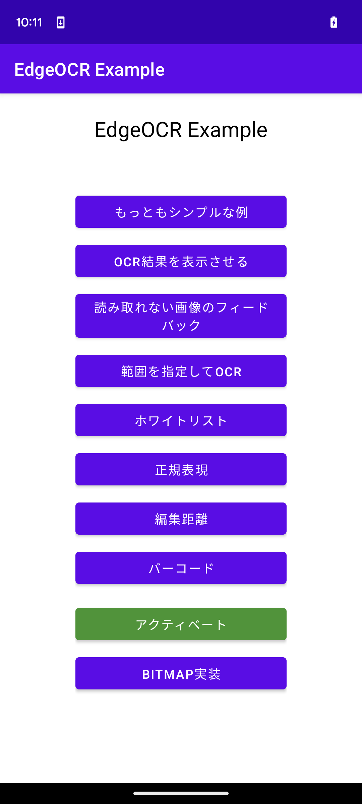

## アクティベーション

SDK のスキャン機能を使う前に、SDK を使用するデバイスでライセンスのアクティベーションを行う必要があります。
アクティベーションはそのデバイスで初めて SDK を使うときのみ必要です。
アクティベーションはオンライン環境で行う必要があります。

> [!WARNING]
> デバイスのファクトリーリセットを行うと、再度のアクティベーションが必要になり、別デバイスとして登録されますのでご注意ください。

アクティベーションの実行、アクティベーション状態の確認を行うために、 `NefrockLicenseAPI` を用います。
```Java
NefrockLicenseAPI licenseAPI = new NefrockLicenseAPI.Builder(<Context>)
    .withLicenseKey(<your key>)
    .build();
```
`<Context>` には、アプリの `Context` を定義してください。
`<your key>` の部分にはライセンスキーを入れてください。

アクティベーションを行うには、`activate` メソッドを呼び出します。
```Java
ListenableFuture<License> activate(
            @Nullable ActivationCallback callback,
            @Nullable ActivationErrorCallback errorCallback);
```
- `callback` には、アクティベーションが成功したときに呼び出されるコールバックを定義します。
- `errorCallback` には、アクティベーションが失敗したときに呼び出されるコールバックを定義します。

一度アクティベーションを行うと、次回以降はアクティベーションを行う必要はありません。
ライセンス情報はファイルに保存されますので、アプリを再起動してもアクティベーションを行う必要はありません。

アクティベーション状態の確認は、`isActivated` で行うことができます。
```Java
ListenableFuture<License> isActivated(
            @Nullable ActivationCallback callback,
            @Nullable ActivationErrorCallback errorCallback);
```
ライセンスファイルが存在するか確認を行います。
ファイルが見つからない場合、サーバーに非同期で問い合わせを行います。
デバイスがアクティベーション済みの場合ライセンスファイルが生成されます。
この関数を呼ぶことにより、新しいデバイスとして登録されることはありません。
- `callback` には、アクティベーションが確認できたときに呼び出されるコールバックを定義します。
- `errorCallback` には、アクティベーションが確認できなかったときに呼び出されるコールバックを定義します。

このアクティベーションフローの例は`app/src/main/java/com/nefrock/edgeocr_example/MainActivity.java`に定義されていますので、ご参考にしてください。

実際にお試し頂く場合は、サンプルアプリを実機にインストールし、起動する最初の画面（メイン画面）で一番下の緑色のアクティベーションボタンを押してください。

「メイン画面」
<br/>

<br/>
<br/>

アクティベーション済みの場合、アクティベーションボタンには「アクティベーション済み」と表示されます。
