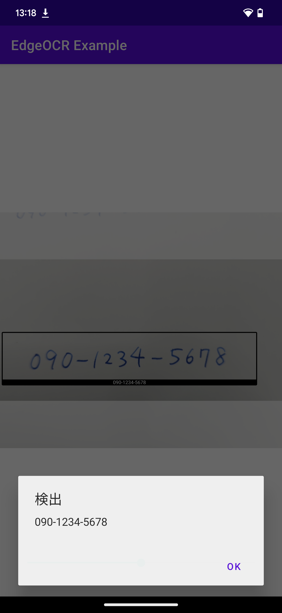

## 実用的な例

[「もっともシンプルな例」](simple-text.md)では、OCR 機能にのみ焦点を当てて説明を行いました。この節では、ユーザーが実際に業務で使用するアプリケーションを作成するヒントとなるようなサンプルを説明いたします。

この節で説明するすべてのサンプルは、`app/src/main/java/com/nefrock/edgeocr_example/custom_analyzer` に実装されています。

### 誤読を減らすために

本章のように、特定のパターンのみを抽出するようにすることで誤読を減らすことができます。

また、`app/src/main/java/com/nefrock/edgeocr_example/custom_analyzer/TextScannerActivity.java`では、`api.setTextNToConfirm`を用いてテキストの確定までの読み取り回数を5回と設定しています。

読み取りが確定した場合は`detection.getStatus()`で`ScanConfirmationStatus.Confirmed`が返ります。

```Java
@ExperimentalCamera2Interop public class TextScannerActivity extends AppCompatActivity {
    // ...
    @Override
    protected void onCreate(Bundle savedInstanceState) {
        // ...
        api.useModel(model, (ModelInformation modelInformation) -> {
            cameraOverlay.setAspectRatio(modelInformation.getAspectRatio());
            api.setTextNToConfirm(5);
            imageAnalyzer.setCallback((filteredDetections, allDetections) -> {
                runOnUiThread(() -> cameraOverlay.setBoxes(allDetections));
                List<Detection<Text>> confirmedDetections = new ArrayList<>();
                for(Detection<Text> detection: filteredDetections) {
                    if (detection.getStatus() == ScanConfirmationStatus.Confirmed) {
                        confirmedDetections.add(detection);
                    }
                }
                if (!showDialog) {
                    return;
                }
                if (confirmedDetections.size() == 0) {
                    return;
                }
                // UIスレッドによるダイアログ表示前にスキャンを止める
                imageAnalyzer.stop();
                runOnUiThread(() -> showDialog(confirmedDetections));
            });
        }, (EdgeError e) -> Log.e("EdgeOCRExample", "[onCreate] Failed to load model", e));
        // ...
    }
    // ...
}
```

もしまだ正しく読み取れていないテキストがありましたら、どうぞ弊社のカスタマーサポートにお気軽にお問い合わせください。当社は独自のOCRモデルを開発しており、特定の文字が読み取りにくい場合や、モデルを改善およびカスタマイズすることで問題を根本的に解決することが可能です。

### ホワイトリスト

実際の運用において、マスターデータとのと都合を想定したサンプルです。こちらの例では、Java の `Set` にマスターデータを保存して、OCR 結果と突合しています。このコードは `WhitelistTextAnalyser` クラスに実装されています。ホワイトリストはここでは特定の電話番号としています。

```Java
public class WhitelistTextAnalyser extends AnalyserWithCallback {

    private final EdgeVisionAPI api;
    private volatile boolean isActive;
    private final Set<String> whiteList;

    public WhitelistTextAnalyser(EdgeVisionAPI api) {
        this.api = api;
        this.isActive = true;
        this.whiteList = new HashSet<String>(){
            {
                add("090-1234-5678");
                add("090-0000-1234");
                add("090-2222-3456");
                add("090-4444-5555");
                add("090-6666-7777");
                add("090-8888-9999");
            }
        };
    }

    @Override @androidx.camera.core.ExperimentalGetImage
    public void analyze(@NonNull ImageProxy image) {
        try {
            if (!isActive) return;
            if (callback == null) return;
            if (!api.isReady()) throw new RuntimeException("Model not loaded!");
            ScanResult scanResult = api.scanTexts(image);
            List<Detection<Text>> detections = scanResult.getTextDetections();
            ArrayList<Detection<Text>> filteredDetections = new ArrayList<>();
            for (Detection<Text> detection : detections) {
                if(whiteList.contains(detection.getScanObject().getText())) {
                    filteredDetections.add(detection);
                    break;
                }
            }
            callback.call(filteredDetections, detections);
        } catch (EdgeError e) {
            Log.e("EdgeOCRExample", Log.getStackTraceString(e));
        } finally {
            image.close();
        }
    }
    //以下略
}
```

`analyze` メソッドの中で、`whitelist` フィールドに含まれるテキストがあったら、それを `callback` の第 1 引数で返しています。第 2 引数はすべての検出オブジェクトを返しています。

また、この例では `whitelist` に含まれる文字列が発見されたら、OCR を中断してダイアログを表示します。

<br/>

<br/>
<br/>


この機能を実装しているのは `TextScannerActivity` クラスの次のコードです。

```Java
imageAnalyser.setCallback(new AnalysisCallback() {
    @Override
    public void call(List<Detection> filteredDetections, List<Detection> allDetections) {
        runOnUiThread(() -> {
            boxesOverlay.setBoxes(allDetections);
        });
        if(!showDialog) {
            return;
        }
        if (filteredDetections.size() == 0) {
            return;
        }
        runOnUiThread(() -> {
            showDialog(filteredDetections);
        });

    }
});
```

`filteredDetections` のサイズが 0 でない場合は、`showDialog` メソッドでダイアログを表示しています。またダイアログを表示し、OCR を中断するかは `showDialog` フィールドで管理しており、これは `MainActivity` から `Intent.putExtra` で渡されています。

```Java
findViewById(R.id.whitelist_ocr_button).setOnClickListener(new View.OnClickListener() {
    @Override
    public void onClick(View view) {
        Intent intent = new Intent(getApplication(), TextScannerActivity.class);
        intent.putExtra("analyser_type", "whitelist");
        intent.putExtra("show_dialog", true);
        startActivity(intent);
    }
});
```

マスターデータに存在する特定の商品コードをスキャンしたいなどのユースケースの場合は、こちらの例を参考にしてみてください。

### 正規表現

「ホワイトリスト」方式では完全に一致するもののみスキャンを行いますが、本節では `正規表現` に一致するフォーマットをスキャンするサンプルを実装します。具体的な日付をスキャンしたいシナリオに対応するためのサンプルです。このコードは `EditDistanceTextAnalyser` クラスで実装されていています。

```Java
public class RegexTextAnalyser extends AnalyserWithCallback {

    private final EdgeVisionAPI api;
    private volatile boolean isActive;
    private final Pattern regexPattern;

    public RegexTextAnalyser(EdgeVisionAPI api) {
        this.api = api;
        //2023.9.30、のような日付のみスキャンする(2020年代のみ)
        this.regexPattern = Pattern.compile(".*(202\\d\\.\\d{1,2}\\.\\d{1,2}).*");
        this.isActive = true;
    }

    @Override @androidx.camera.core.ExperimentalGetImage
    public void analyze(@NonNull ImageProxy image) {
        try {
            if (!isActive) return;
            if (callback == null) return;
            if (!api.isReady()) throw new RuntimeException("Model not loaded!");

            ScanResult scanResult = api.scanTexts(image);
            List<Detection> rawDetections = scanResult.getDetections();
            List<Detection> filteredDetection = new ArrayList<>();
            for (Detection rawDetection : rawDetections ) {
                String text = rawDetection.getText();
                Matcher matcher = regexPattern.matcher(text);
                if(matcher.find()) {
                    String newText = matcher.group(1);
                    Detection newDetection = rawDetection.copyWithText(newText);
                    filteredDetection.add(newDetection);
                }
            }
            callback.call(filteredDetection, rawDetections);
        } catch (RuntimeException e) {
            Log.e("EdgeOCRExample", Log.getStackTraceString(e));
        } finally {
            image.close();
        }
    }
    // ...
}
```

このサンプルでは簡単のためドット区切りのみ採用する実装を行っていますが、正規表現を修正すれば「年月日」や「ハイフン区切り」などのフォーマットにも対応可能です。

### 編集距離

環境が暗い、特殊なフォントが使用されている、または手書き漢字をスキャンする必要があるなどが理由で OCR の精度が低い場合、基本的にはモデルのカスタマイズを検討することをお勧めいたします。

ただし、特定のユースケースでは[編集距離](https://ja.wikipedia.org/wiki/レーベンシュタイン距離)に基づくマッチングを使用することで改善できる場合があります。このアプローチはホワイトリスト方式とは異なり、完全一致ではなく、ある程度の誤りを許容するマッチング方法です。

この機能は、`EditDistanceTextAnalyser` に実装されており、この例では関東地方の県名とのマッチングを行っています。

```Java
public class EditDistanceTextAnalyser extends AnalyserWithCallback {

    private final EdgeVisionAPI api;
    private volatile boolean isScanning;
    private final Levenshtein metrics;
    private final List<String> candidates;

    public EditDistanceTextAnalyser(EdgeVisionAPI api) {
        this.api = api;
        this.isScanning = true;
        this.metrics = new Levenshtein();
        this.candidates = new ArrayList<String>() {
            {
                add("東京都");
                add("神奈川県");
                add("群馬県");
                add("埼玉県");
                add("茨城県");
                add("栃木県");
                add("千葉県");
            }
        };
    }

    @Override
    @androidx.camera.core.ExperimentalGetImage
    public void analyze(@NonNull ImageProxy image) {
        try {
            if (!isScanning)
                return;
            if (callback == null)
                return;
            if (!api.isReady())
                throw new RuntimeException("Model not loaded!");

            ScanResult scanResult = api.scanTexts(image);
            List<Detection> rawDetections = scanResult.getDetections();
            List<Detection> filteredDetections = new ArrayList<>();
            for (Detection detection : rawDetections) {
                // N文字の間違いを許容する
                double minDist = 2;
                String text = detection.getText();
                Detection d = null;
                String minText = "";
                for (String candidate : candidates) {
                    double currentDist = metrics.distance(candidate, text);
                    if (currentDist < minDist) {
                        d = detection;
                        minDist = currentDist;
                        minText = candidate;
                    }
                }
                if (d != null) {
                    Detection newDetection = d.copyWithText(minText);
                    filteredDetections.add(newDetection);
                }
            }
            callback.call(filteredDetections, scanResult.getDetections());
        } catch (RuntimeException e) {
            Log.e("EdgeOCRExample", Log.getStackTraceString(e));
        } finally {
            image.close();
        }
    }
    // ...
}

```

検出されたテキストにもっとも近い都道府県を検出結果として `filteredDetections` に追加しています。ここでは編集距離が 2 までを許容範囲としています。

説明はこれで終了ですが、検出オブジェクトにはバウンディングボックス（位置とサイズ情報）も含まれており、これを活用して下記のような検出位置に関する処理も記述できます。

- 画面の中心にあるものを読む
- 最も大きい文字を読む
- 「賞味期限」の横の文字を読む

現在に取り組んでいる問題の実装方法でご不明点がございましたら、弊社のカスタマーサポートにご連絡ください。弊社ではアプリへの組み込みのサポートも行っております。
