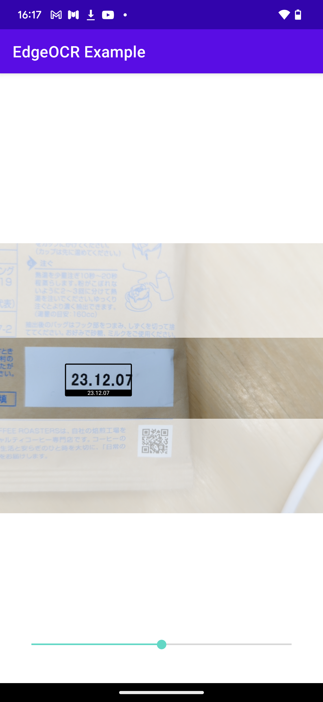
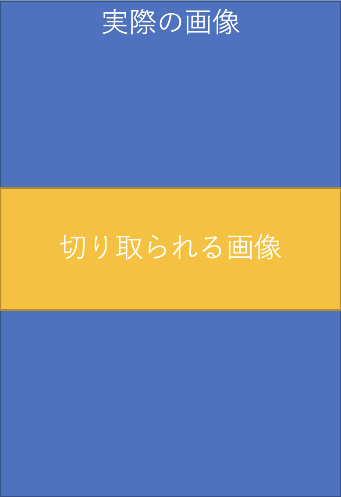

## OCR結果を画面に表示する

このサンプルでは OCR 結果を画面に表示する方法を説明いたします。
完成画面イメージは下記画像です。

<br/>

<br/>
<br/>

こちらのサンプルでは[「もっともシンプルな例」](simple-text.md)に加えて次の 2 つのことを行っています。

- SDK のスキャン範囲外の画面をホワイトアウトする
- OCR 結果を画面上に表示する

### SDK が解析する画像の範囲について
実装方法について説明を行う前に、SDK が解析する画像の範囲について説明を行います。
`api.scanTexts` が解析する範囲は、指定したモデルに依存します。
ここではデフォルトで提供されている `model-large` を例に説明を行っていきます。

モデルはインプットとして取れる画像のアスペクト比を持っており、
`model-large` では`256x128（width x height）` のアスペクト比の画像をインプットの画像として受け取ることを想定しています。

インプットの画像として、モデルが想定しているアスペクト比とは異なる画像が渡された場合は、SDK は画像をそのアスペクト比になるように、画像の一部（デフォルトの場合は中心部分）を切り取った後、モデルに渡します。

下記の画像のように、横幅はインプット画像の幅を基準としてモデルのアスペクト比を保つように縦幅を算出します。

たとえば SDK に入力する画像のサイズを 360x720 とすると、モデルに渡される画像の大きさは、横幅はそのままの 360 で、縦幅が 360x64/256=90 となります。



このように、SDK がスキャンする画像の範囲はカメラ映像と殆どの場合一致しないので本サンプルでは、SDK がスキャンする画像の範囲をホワイトアウトすることで、スキャン範囲を分かりやすく表示する方法を説明いたします。

### 実装
SDKに含まれている `CameraOverlay` を用いることで簡単に OCR 結果の表示や、画面のホワイトアウトを実装することができます。

#### 画面レイアウトの定義
画面レイアウトの定義は`app/src/main/res/activity_text_scanner.xml`で行っています。
`PreviewView` の上に同じサイズの`CameraOverlay` を配置します。
```xml
<com.nefrock.edgeocr.ui.CameraOverlay
        android:id="@+id/camera_overlay"
        android:layout_width="0dp"
        android:layout_height="0dp"
        app:layout_constraintTop_toTopOf="@+id/previewView"
        app:layout_constraintBottom_toBottomOf="@+id/previewView"
        app:layout_constraintStart_toStartOf="@+id/previewView"
        app:layout_constraintEnd_toEndOf="@+id/previewView" />
```

#### モデルアスペクト比の設定
SDKのスキャン範囲外をホワイトアウトするためには、`CameraOverlay` にモデルのアスペクト比を設定する必要があります。

アスペクト比は、使用するモデルを指定した時の `ModelInformation` オブジェクトの `getAspectRatio` メソッドを用いて取得できます。
`MainActivity.java` でモデルロード時に取得したアスペクト比をインテントを通して、 `CameraOverlayTextScannerActivity.java` に渡しています。
また、取得したモデルアスペクト比を `CameraOverlay` に設定しています。
`app/src/main/java/com/nefrock/edgeocr_example/MainActivity.java`と`app/src/main/java/com/nefrock/edgeocr_example/camera_overlay/CameraOverlayTextScannerActivity.java` を参照してください。

```Java
api.useModel(model, modelSettings, modelInformation -> {
    intent.putExtra("model_aspect_ratio", modelInformation.getAspectRatio());
    startActivity(intent);
}, edgeError -> Toast.makeText(getApplicationContext(), edgeError.getMessage(), Toast.LENGTH_LONG)
    .show());
```

```Java
float modelAspectRatio = getIntent().getFloatExtra("model_aspect_ratio", 1.0f);
cameraOverlay = findViewById(R.id.camera_overlay);
cameraOverlay.setAspectRatio(modelAspectRatio);
```

#### OCR 結果の表示
AnalyzerのコールバックにOCR結果を表示するように記述しています。
`CameraOverlay` の `setBoxes` メソッドに `List<Detection>` を渡すことで、OCR 結果を表示することができます。
`app/src/main/java/com/nefrock/edgeocr_example/camera_overlay/CameraOverlayTextScannerActivity.java` を参照してください。

また、モデルのロードが終了していない場合、`api.isReady()` が `false` になるため、必ずアスペクト比が設定されてからスキャン結果が表示されるようになっています。
```Java
imageAnalysis.setAnalyzer(analysisExecutor, image -> {
    if (!api.isReady()) {
        image.close();
        return;
    }
    try {
        ScanResult scanResult = api.scanTexts(image);
        List<Detection<Text>> detections = scanResult.getTextDetections();
        cameraOverlay.setBoxes(detections);
    } catch (EdgeError e) {
        Log.e("EdgeOCRExample", "[startCamera] Failed to analyze image", e);
    } finally {
        image.close();
    }
});
```
